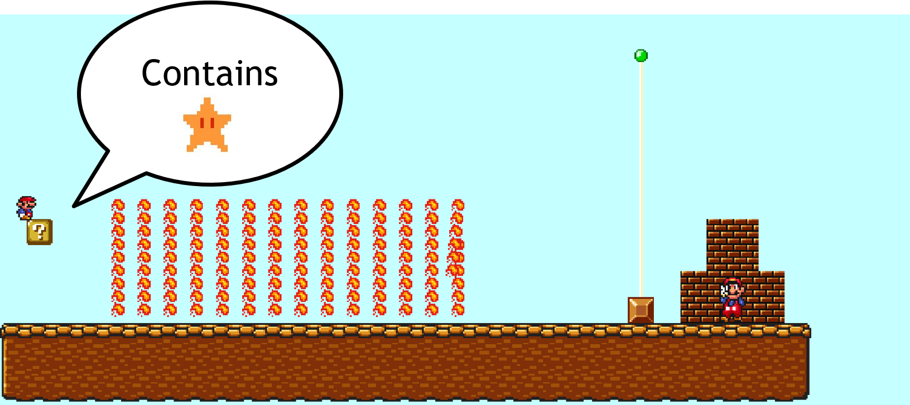
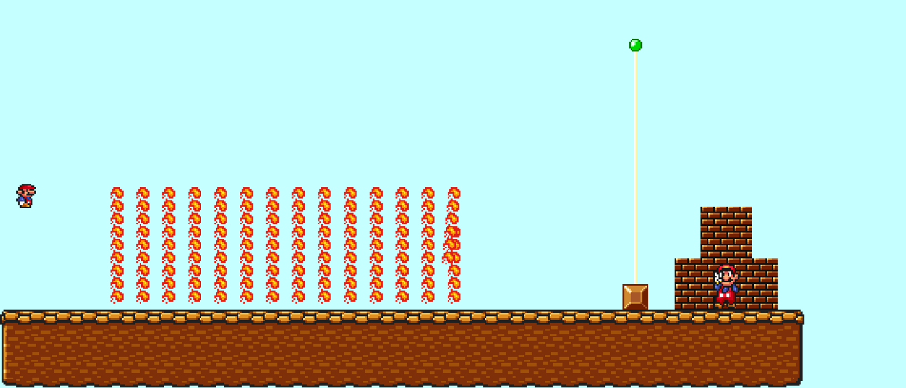

# Super Mario Bros.

Super Mario Bros. is a classic platform game developed by Nintendo in 1985. 
The game follows **Mario**, an Italian plumber, on his quest to rescue 
**Princess Peach** from the villainous **Bowser**. Along the way, 
Mario must navigate challenging levels filled with obstacles, enemies, 
and power-ups.

Beyond its status as an iconic video game, Super Mario Bros. has been studied in 
computational complexity theory. In this discussion, we will explore how certain 
level configurations in the game can be used to encode logical constraints, 
ultimately proving that determining whether a given level is passable is an 
**NP-hard** problem.

# Problem Formulation

## The $\text{3SAT}$ Problem

Before we define the Super Mario Bros. problem, let's introduce (or review) the 3-satisfiability ($\text{3SAT}$) problem. 

- A **Boolean formula** is a mathematical expression consisting of Boolean variables (taking values `true` or `false`), 
logical operators (AND ($\wedge$), OR ($\vee$), NOT ($\neg$)) and parentheses for grouping. It evaluates to either `true` or `false` based on variable assignment.
- A Boolean formula is **satisfiable** is there exists an assignment to the variables such that the formula evaluates to be true. 
- A **literal** is a Boolean variable or a negated Boolean variable, as in $x$ or $\neg x$.
- A **clause** is a *disjunction* ($\vee$) of several literals.
- A Boolean formula is in **conjunctive normal form** (CNF) is it is a *conjunction* ($\wedge$) of several clauses.
- A **3 CNF formula** is a CNF formula that has exactly *three* literals per clause. For example, 

$$
\phi = (x_1 \vee x_3 \vee \neg x_4) \wedge (\neg x_2 \vee x_3 \vee \neg x_5)
$$

is a satisfiable 3CNF formula. One true assignment is $x_1 = $ `true` and $x_2 = x_3 = x_4 = x_5 =$ `false`.

The $\text{3SAT}$ problem is defined to be the set of satisfiable 3CNF formula:

$$
\text{3SAT} = \{\phi: \text{$\phi$ is a satisfiable 3CNF formula}\}
$$

We will show that the Super Mario Bros. problem is NP-hard via a [polynomial-time mapping reduction](https://eecs376.github.io/notes/complexity.html#polynomial-time-mapping-reductions) from $\text{3SAT}$. 

## The Super Mario Bros. Problem

Before we formally define the complexity of the Super Mario Bros. problem, let’s describe the core mechanics of the game that affect level passability.

- A Super Mario Bros. level consists of platforms, obstacles, enemies, and power-ups that Mario must navigate to reach the goal.
- A level is **passable** if Mario can reach the goal given the available power-ups and mechanics.

Here, we introduce several key elements of the game that are relevant to the reduction.

### Mario's Forms

Mario has different forms that impact his abilities:

- **Normal Mario**: The default form with basic movement and jumping.
- **Super Mario**: Gained by collecting a **Super Mushroom** , allowing Mario to break bricks.
- **Invincible Mario**: Temporarily obtained by collecting a **Super Star** , making Mario immune to enemies and hazards.

### Basic Environment Elements

Several types of blocks and structures shape the levels in *Super Mario Bros.*:

- **Normal Blocks**  : Static, inert blocks that Mario can stand on.
- **Item Blocks** : Contain power-ups such as **Super Mushrooms** or **Super Stars**, which are released when hit from below.
- **Bricks** : Can be destroyed by **Super Mario** when hit from below.
- **Pipes** : Transport Mario between different sections of a level.

To simplify our problem, we also allow the use of **palace switches** : 

- When Mario activates a **Palace Switch**, it transforms solid blocks of a matching color into transparent blocks.
- This allows Mario to access previously blocked paths and continue progressing through the level.

### The Level Passability Decision Problem

The **Super Mario Bros. problem** is defined as the decision problem:

$$
\text{SMB} = \{ S : S \text{ is a passable Super Mario Bros. level} \}
$$

- **Example of a non-passable level**: Mario (even as Super Mario) cannot pass through fire bars.

- **Example of a passable level**: Mario can collect a star from an item block, turn into Invincible Mario, and pass through fire bars.

# Polynomial-Time Mapping Reduction (PTMR)

Now, we will describe a PTMR from $\text{3SAT}$ to $\text{SMB}$. Given an a 3CNF formula, our goal is to construct a Super Mario Bros. level that is passable if and only if the formula is satisfiable. 

## Gadgets

A common trick for reducing from $\text{3SAT}$ is to create variable "gadgets" and clause "gadgets". 