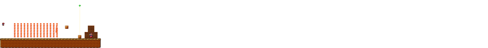
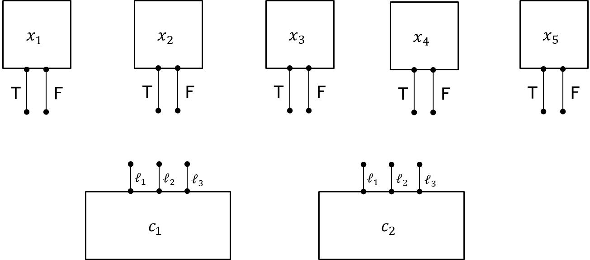
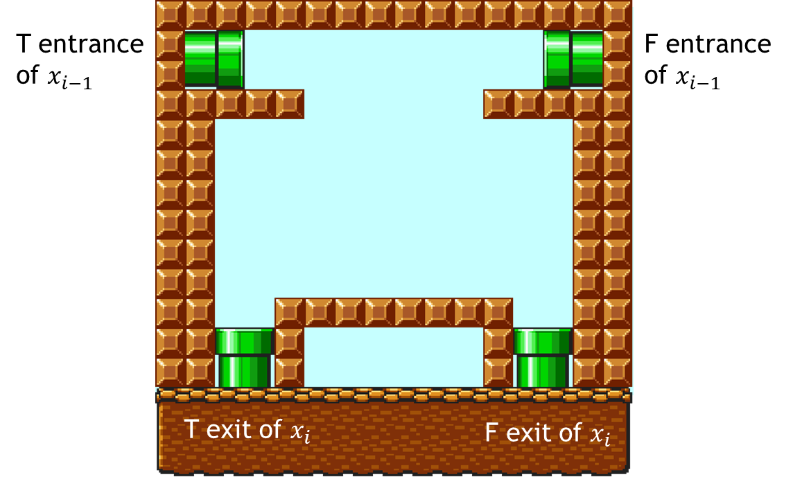
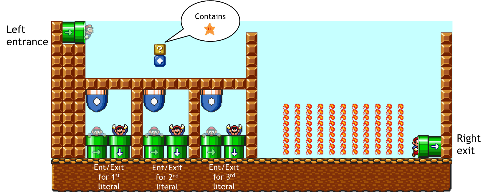
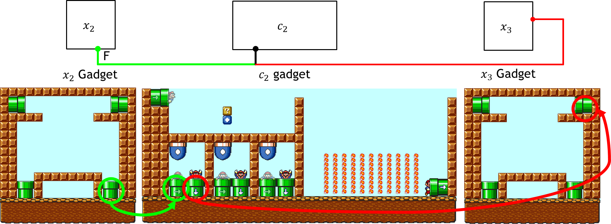
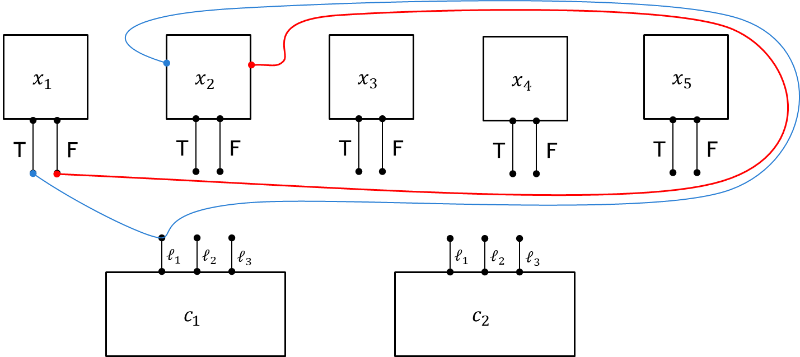
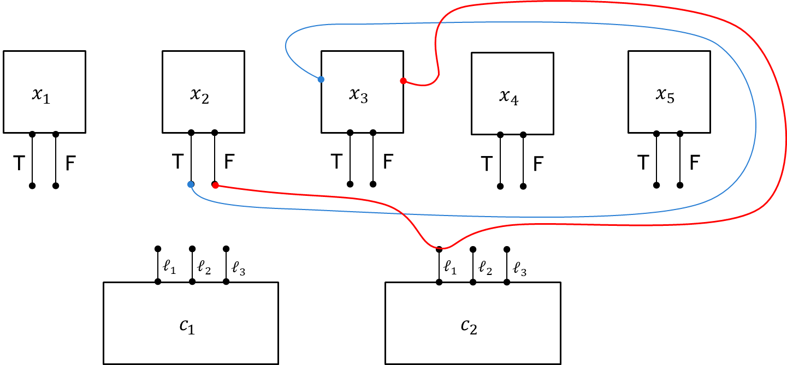
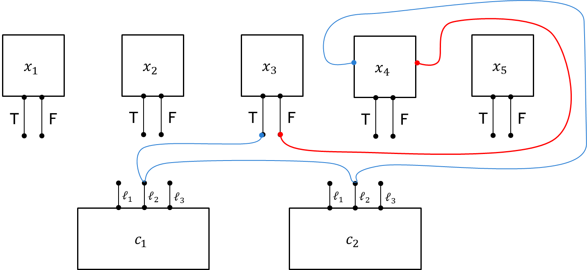

# Super Mario Bros.

Super Mario Bros. is a classic platform game developed by Nintendo in 1985. 
The game follows **Mario**, an Italian plumber, on his quest to rescue 
**Princess Peach** from the villainous **Bowser**. Along the way, 
Mario must navigate challenging levels filled with obstacles, enemies, 
and power-ups.

Beyond its status as an iconic video game, Super Mario Bros. has been studied in 
computational complexity theory. In this discussion, we will explore how certain 
level configurations in the game can be used to encode logical constraints, 
ultimately proving that determining whether a given level is passable is an 
**NP-hard** problem. (In fact, the problem is NP-complete)

# Problem Formulation

## The $\text{3SAT}$ Problem

Before we define the Super Mario Bros. problem, let's introduce (or review) the 3-satisfiability ($\text{3SAT}$) problem. 

- A **Boolean formula** is a mathematical expression consisting of Boolean variables (taking values `true` or `false`), 
logical operators (AND ($\wedge$), OR ($\vee$), NOT ($\neg$)) and parentheses for grouping. It evaluates to either `true` or `false` based on variable assignment.
- A Boolean formula is **satisfiable** is there exists an assignment to the variables such that the formula evaluates to be true. 
- A **literal** is a Boolean variable or a negated Boolean variable, as in $x$ or $\neg x$.
- A **clause** is a *disjunction* ($\vee$) of several literals.
- A Boolean formula is in **conjunctive normal form** (CNF) is it is a *conjunction* ($\wedge$) of several clauses.
- A **3 CNF formula** is a CNF formula that has exactly *three* literals per clause. For example, 

$$
\phi = (x_1 \vee x_3 \vee \neg x_4) \wedge (\neg x_2 \vee x_3 \vee \neg x_5)
$$

is a satisfiable 3CNF formula. One true assignment is $x_1 = $ `true` and $x_2 = x_3 = x_4 = x_5 =$ `false`.

The $\text{3SAT}$ problem is defined to be the set of satisfiable 3CNF formula:

$$
\text{3SAT} = \{\phi: \text{$\phi$ is a satisfiable 3CNF formula}\}
$$

We will show that the Super Mario Bros. problem is NP-hard via a [polynomial-time mapping reduction](https://eecs376.github.io/notes/complexity.html#polynomial-time-mapping-reductions) from $\text{3SAT}$. 

## The Super Mario Bros. Problem

Before we formally define the complexity of the Super Mario Bros. problem, let’s describe the core mechanics of the game that affect level passability.

- A Super Mario Bros. level consists of platforms, obstacles, enemies, and power-ups that Mario must navigate to reach the goal.
- A level is **passable** if Mario can reach the goal given the available power-ups and mechanics.

Here, we introduce several key elements of the game that are relevant to the reduction.

### Mario's Forms

Mario has different forms that impact his abilities:

- **Normal Mario**: The default form with basic movement and jumping.
- **Super Mario**: Gained by collecting a **Super Mushroom** , allowing Mario to break bricks.
- **Invincible Mario**: Temporarily obtained by collecting a **Super Star** , making Mario immune to enemies and hazards.

### Basic Environment Elements

Several types of blocks and structures shape the levels in *Super Mario Bros.*:

- **Normal Blocks**  : Static, inert blocks that Mario can stand on.
- **Item Blocks** : Contain power-ups such as **Super Mushrooms** or **Super Stars**, which are released when hit from below.
- **Bricks** : Can be destroyed by **Super Mario** when hit from below.
- **Pipes** : Transport Mario between different sections of a level.

To simplify our problem, we also allow the use of **palace switches** : 

- When Mario toggles a **Palace Switch**, it transforms solid blocks of a matching color into transparent blocks.
- This allows Mario to access previously blocked paths and continue progressing through the level.

### The Level Passability Decision Problem

We define the **Super Mario Bros.** ($\text{SMB}$) language as the set of passable Super Mario Bros. levels:

$$
\text{SMB} = \{ S : S \text{ is a passable Super Mario Bros. level}. \}
$$

- **Example of a non-passable level**: Mario (even as Super Mario) cannot pass through fire bars.

- **Example of a passable level**: Mario can collect a star from an item block, turn into Invincible Mario, and pass through fire bars.

# Polynomial-Time Mapping Reduction (PTMR)

Now, we will describe a PTMR from $\text{3SAT}$ to $\text{SMB}$. Given an a 3CNF formula, our goal is to construct a Super Mario Bros. level that is passable if and only if the formula is satisfiable.

A common trick for reducing from $\text{3SAT}$ is to create variable "gadgets" and clause "gadgets". In our reduction, each gadget would correspond to a part of a level. For simplicity, we will put each part in a map and use pipes to teleports between them.

> For example, the formula $\phi = (x_1 \vee x_3 \vee \neg x_4) \wedge (\neg x_2 \vee x_3 \vee \neg x_5)$ has five variables and two clauses, so we will have five variables gadgets and two clause gadgets. 

> 

### Variable Gadgets

Each variable gadget represents a Boolean variable $x_i$ and provides two possible exits: one corresponding to $x_i =$ `true` and one to $x_i =$ `false`. 

Mario enters the variable gadget from above. The design ensures that once Mario drops down from the entrance platform, he **cannot jump back up**, enforcing a *one-way passage*. This guarantees that each variable is assigned a consistent truth value throughout the level.  

- If Mario chooses the **`true` path**, he will be visiting **clause gadgets containing $x_i$**.
- If Mario chooses the **`false` path**, he will be visiting **clause gadgets requiring $\neg x_i$**.

    

### Clause Gadgets

Each clause gadget represents a clause in the 3SAT formula and ensures that Mario can only pass through if at least one of the literals in the clause is `true`. There are two ways of entering the clause gadget: either through the literal entrances or the left entrance. 

The clause gadget has **three literal entrance/exit pairs**, each corresponding to one of the three literals in the clause.

- If Mario arrives through any of these entrances, it means the corresponding literal is `true`.
- This allows Mario to toggle a Palace Switch, which turns the solid block into a transparent block.
- Once toggled, the block remainds transparent for the rest of the level. 
- Mario leaves the clause gadget using the corresponding literal exit.

When Mario (re)enters the clause gadget using the left entrance, if at least one of the Palace switches have been toggled before, then Mario can obtain the Super star, transform into invincible Mario, get through the fire bars and exit through the right exit. Otherwise, Mario will not be able to pass through this clause gadget when he enters through the left entrance.

    

### Connecting The Gadgets

Now that we have constructed the variable gadgets and clause gadgets, we need to connect them to form a Super Mario Bros. level that corresponds to a given 3CNF. The connections ensure that Mario traverses the level according to a **consistent Boolean assignment**, enforcing that each Boolean variable has exactly one truth value.

Connecting gadgets means linking a specific exit of one gadget to a specific entrance of another gadget. In the example below:
- We connect the false exist of the $x_2$ variable gadget to the literal entrance of $\neg x_2$ in the clause gadget for $c_2$. 
- Then, we connect the literal exit of $\neg x_2$ of the clause gadget to the false entrance of the $x_3$ variable gadget (since this path correspond to $x_2$ = `false`).
- This ensures that Mario teleports between gadgets using pipes, enforcing the logical structure of the reduction.

> 

We will now connect the variable gadgets and the clause gadgets. We will use the formula $\phi = (x_1 \vee x_3 \vee \neg x_4) \wedge (\neg x_2 \vee x_3 \vee \neg x_5)$ from earlier to illustrate along the way. 

1. For each variable $x_i$, we connect its exists to all clauses where it appears:
    - The T-exit (if Mario chooses `true`) is connected to **all clause gadgets** where $x_i$ appears positively.
    - The F-exit (if Mario chooses `false`) is connected to **all clause gadgets** where $\neg x_i$ appears.

2. After linking $x_i$ to all relevant clause gadgets, we then connect:
   - The exit of the last clause gadget containing $x_i$ to the T-entrance of the $x_{i+1}$ variable gadget.
   - The exit of the last clause gadget containing $\neg x_i$ to the F-entrance of the $x_{i+1}$ variable gadget.
   - If no such clause gadgets exist, connect directly from the T/F-exit of $x_i$ to the T/F entrance of $x_{i+1}$.

    > For example, $x_1$ only appears in $c_1$ and no clauses contain $\neg x_1$, so we have

    > 

    > Similarly, $\neg x_2$ only appears in $c_2$ and no clauses contain $x_2$, so we have

    > 

    > Both $c_1$ and $c_2$ contains $x_3$, so

    > 

    > We connect similarly for $x_4$ and $x_5$:

    > 

    > 

So far, 